# Development Fund Proposal

## Token Standard Reference Implementation (CIP-0056 / CIP-0112)

| Field | Value |
| :---- | :---- |
| Author | Randy Harrison — Avro Digital |
| Status | Submitted |
| Created | 2026-05-01 |
| Label | `token-asset-standards` |
| Champion | Avro Digital |

---

## Abstract

Avro Digital requests 11,000,000 Canton Coin (CC) to deliver a production-grade open-source reference suite for CIP-0056, with a migration path into CIP-0112, covering six issuer-relevant asset classes and reusable compliance hooks.

CIP-0056 defines the current standard APIs — holdings, transfer instructions, allocations, allocation requests, and registry metadata — that wallets and apps use to interact uniformly with any token on the network. CIP-0112 is its backward-compatible v2 evolution, adding privacy, performance, and traditional-accounting improvements at the standard layer. However, neither standard is intended to specify asset-class lifecycle patterns: bond coupons, equity dividends and corporate actions, structured-product tranche waterfalls, or the compliance-hook patterns that regulated issuers need. Today, every new institutional token issuer on Canton faces a blank-canvas problem.

This proposal organizes the work into six tightly scoped workstreams: cash and stablecoin, fixed income, equity with corporate actions, commodities and warehouse receipts, structured products, and a compliance hook library covering common regulatory categories. It also includes a migration path from CIP-0056 into CIP-0112, coordinated with Digital Asset's in-flight CIP-0112 work.

This proposal is intentionally complementary to Digital Asset's protocol and standard-level work. Digital Asset evolves the token-standard layer through CIP-0056 and CIP-0112; Avro Digital ships the asset-class reference implementations that regulated issuers, wallets, and applications build on top of that layer. The proposal does **not** attempt to redefine the standard, compete with existing token deployments, or ship a closed-source template library.

---

## Specification

### 1. Objective

Deliver a suite of production-grade open-source reference implementations on top of CIP-0056's current interface surface, packaged with test harnesses, lifecycle documentation, a compliance hook library, and a migration path into CIP-0112 aligned with Digital Asset's token standard evolution.

The project includes:

- A cash and stablecoin reference implementation establishing the canonical baseline pattern for CIP-0056 adoption
- A fixed-income reference implementation covering bond, note, and commercial-paper lifecycle (issuance, coupon accrual and payment, amortization, maturity, recall)
- An equity reference implementation covering dividend distribution, stock splits, and standard corporate actions
- A commodities and warehouse-receipt reference implementation covering fungible and non-fungible commodity representations
- A structured-product reference implementation covering tranche issuance and waterfall distributions
- A compliance hook library providing reusable Reg A / Reg D / Reg S / MiCA / FINMA pattern implementations as composable interfaces — patterns for legal teams to parameterize, not legal conclusions
- A migration path from CIP-0056 into CIP-0112 aligned with Digital Asset's token standard evolution
- A comprehensive test harness suite and issuer-facing integration documentation for each reference

Explicit non-goals:

- Redefinition or replacement of CIP-0056 interface semantics
- A closed-source proprietary template library
- Custody, wallet, or settlement-venue implementations (this proposal is about asset representations, not the rails that move them)
- Jurisdiction-specific legal or compliance advice; the Compliance Hook Library provides patterns that legal advisors can parameterize, not legal conclusions
- Issuance of actual regulated instruments on mainnet as part of this grant

These should be treated as follow-on work or as out-of-scope for this proposal.

### 2. Implementation Mechanics

The implementation is organized around six tightly scoped workstreams. Across the suite, four design constraints apply: the references remain fully compatible with CIP-0056; lifecycle events target stable instrument identities rather than ephemeral holder state; scalability guidance is respected through consolidation and batched variants where needed; and workflows that mix on-ledger and off-ledger steps use explicit recovery paths rather than assuming single-transaction atomicity.

**Workstream A: Cash and Stablecoin Reference Implementation**

The baseline pattern for fungible cash-equivalent instruments.

- Cash and stablecoin templates implementing the full CIP-0056 surface
- Mint, burn, transfer-preapproval, and holder-state management patterns suitable for issuer deployment
- Test harness proving interoperability, cross-participant routing, and holder-cardinality discipline

**Workstream B: Fixed-Income Reference Implementation**

Fixed income is the highest-priority lifecycle-heavy asset class in scope.

- Reference contracts for bonds, notes, and commercial paper
- Coupon, amortization, maturity, call/put, and recall flows in both per-holder and batched forms
- Issuer documentation and a full lifecycle test scenario from issuance through secondary transfer

**Workstream C: Equity and Corporate Actions Reference Implementation**

- Equity contracts covering common and preferred share classes
- Dividend, split, rights-issuance, buyback, and governance-related flows
- Test harness covering corporate-action lifecycle, cross-participant distribution, and holder-cardinality management

**Workstream D: Commodities and Warehouse Receipts Reference Implementation**

- Fungible commodity and non-fungible warehouse-receipt references
- Attestation and redemption flows linking on-ledger positions to off-ledger custody
- Test harness covering both commodity classes, failure handling, and cross-participant deployment

**Workstream E: Structured Products Reference Implementation**

- Tranche-based structured-product reference with waterfall distributions and trigger events
- Collateral-pool and multi-period cash-flow handling patterns
- Scenario tests for tranche distribution, repeated collection periods, and holder-state discipline

**Workstream F: Compliance Hook Library and CIP-0112 Migration Path**

Two related deliverables bundled for coherence.

- Reusable compliance hooks for Reg A, Reg D, Reg S, MiCA, and FINMA-style deployments
- A shared authorization and privacy model for restricted holdings and regulator actions
- Migration tooling and documentation aligned with CIP-0112 timing and compatibility rules
- Test coverage for privacy, routing, and batched migration at realistic holder counts

### 3. Architectural Alignment

This proposal anchors to two of the Canton Foundation's Q2 ecosystem priorities — **App Building & Developer Experience** (every institutional issuer can adopt a CIP-0056-conformant reference implementation rather than re-engineer the asset-class lifecycle from scratch) and **Scaling the Network** (the references encode the active-contract-count and transfer-input-count discipline so the next wave of issuers does not inflate on-ledger state).

It is aligned with Canton token-standard architecture in five ways:

- It builds on CIP-0056's existing interface surface rather than proposing a parallel standard. Every reference implementation consumes the standard's `Holding`, `TransferInstruction`, `Allocation`, `AllocationRequest`, and registry-metadata APIs without modification.
- It complements rather than competes with Digital Asset's token standard evolution. Digital Asset's CIP-0112 work (Token Standard V2; canton-dev-fund PR #97, merged and approved 2026-04-23) and Avro Digital's asset-class references are orthogonal axes of ecosystem investment: DA evolves the standard, Avro ships the references.
- Compliance hooks use CIP-0056's identity-aware design (every party is a known legal entity identified by a Daml party identity) rather than introducing external identity primitives.
- Transfer preapproval and external-signing integrations use CIP-0103-compatible patterns without introducing competing signing flows.
- UTXO management recommendations (below ~10 active Holding contracts per holder, below 100 input contracts per transfer) are preserved throughout; the reference implementations do not introduce patterns that would inflate on-ledger state.

### 4. Backward Compatibility

Backward compatibility is a core design constraint for this project:

- Existing CIP-0056 deployments (Canton Coin, USDCx, CBTC, CantonSwap integrations) continue to function unchanged. The reference implementations are new templates, not replacements for existing ones.
- The reference implementations consume the CIP-0056 v1 interface surface without modification. Issuers adopting the references need no Canton or Splice protocol changes.
- The CIP-0112 migration path from Workstream F is designed to preserve holder state, history, and outstanding transfer instructions across the migration.
- Test harnesses included with each reference implementation validate interoperability with existing CIP-0056 token deployments, including Amulet.
- The Compliance Hook Library's patterns are additive. Issuers adopt individual hooks without being required to adopt the full library.

### 5. Existing Ecosystem Fit

This proposal extends rather than replaces existing Canton token infrastructure. The matrix below makes the relationship explicit, since the Tech & Ops Committee asks "what existing component does this extend? Why can't it?" of every infrastructure proposal:

| Component | Relationship | Why this primitive cannot live there |
| :---- | :---- | :---- |
| **CIP-0056 v1 (Token Standard)** | Extends, no interface change | CIP-0056 specifies the standardized interface surface (holdings, transfers, allocations, registry metadata); asset-class lifecycle patterns (coupon, dividend, waterfall, attestation) are explicitly out of scope and would expand the standard's surface area |
| **CIP-0112 (Token Standard V2; DA grant PR #97, merged 2026-04-23)** | Coordinated; migration target | CIP-0112 is the backward-compatible evolution of CIP-0056 aimed at privacy, performance, and traditional-accounting use cases; this proposal ships the asset-class references that make that evolution immediately deployable. Workstream F coordinates migration from CIP-0056 into CIP-0112 so issuers adopting the current references are not stranded when CIP-0112 lands |
| **CIP-0103 (External Signing)** | Composes | CIP-0103 is the signing channel; asset-class lifecycle workflows (coupon issuance, dividend distribution, corporate actions) layer above as Daml choices that consume CIP-0103-compatible signing |
| **CIP-0104 (Traffic-Based App Rewards)** | Out of scope; documented interaction | Asset-class lifecycle events (every coupon payment, every dividend distribution, every waterfall collection period) generate ledger transactions which under CIP-0104 generate traffic-based app rewards for the issuer's operator participant. The integration guide documents this interaction so issuers can choose lifecycle granularity (per-holder vs batched per cohort) without prescribing economic policy |
| **Splice (Amulet / Wallet UI / Validator)** | Consumes Splice as-is | Splice is the runtime; asset-class Daml packages distribute as standard DARs |
| **Existing CIP-0056 deployments (Canton Coin, USDCx, CBTC)** | Composable, no dependency in either direction | These are fungible cash-equivalents; the cash/stablecoin reference (Workstream A) provides the canonical baseline pattern that the next wave of stablecoin issuers can adopt without reverse-engineering the existing deployments |
| **CantonSwap (Obsidian)** | Composable, no dependency in either direction | CantonSwap demonstrated atomic cross-token swap on CIP-0056; the asset-class references provide the issued instruments that swap-shaped applications transact in |
| **PQS (Participant Query Store)** | Consumes existing event-stream conventions | Asset-class lifecycle events are emitted with the same shape as ordinary CIP-0056 allocation events; reporting integrations consume identical telemetry |
| **DPM (Daml Package Management)** | Consumes existing DAR upload workflow | No DPM extension is proposed |
| **PR #186 (Canton Native Yield Token / CC20)** | Composable, no dependency in either direction | PR #186 ships a yield-bearing-token primitive at the instrument layer; the fixed-income reference (Workstream B) provides the lifecycle wrapper (coupon accrual, amortization, maturity) that yield-token issuers compose with |
| **PR #73 (Institutional Undercollateralized Credit)** | Composable, no dependency in either direction | PR #73 ships a credit-instrument primitive; the fixed-income reference applies regardless of whether the underlying instrument is collateralized |
| **PR #8 (DPMC RWA Protocol)** | Composable, no dependency in either direction | PR #8 ships a real-world-asset protocol; the commodities and warehouse-receipt references (Workstream D) cover the asset-class lifecycle layer that RWA-shaped applications adopt |
There is no existing Canton primitive providing the asset-class lifecycle reference layer this proposal targets. Building each asset class inside one issuer's deployment would fragment the ecosystem; building them as reference implementations lets every future issuer adopt the same primitives.

---

## Assumptions

The following assumptions underlie the milestone schedule and acceptance conditions. If any breaks materially, Avro Digital will surface it in the next quarterly committee report and propose a scope adjustment rather than absorb the slip silently. Where slippage gates a milestone, the External-dependency carve-out documented in Acceptance Criteria applies.

- Digital Asset's CIP-0112 work remains available in workable form by Milestone 5, or the migration work is re-scoped to validate against whatever CIP-0112 material exists at that point.
- The CIP-0056 v1 interface surface remains stable through the first four milestones.
- At least two third-party design partners can be engaged for fixed-income, equity, commodities, or structured-products validation, and one issuer legal counsel can act as a sounding board on the compliance hooks.
- External-party issuer deployments route on `global-domain`; the references document the deployment choice and cross-participant routing expectations.
- Cash/stablecoin validation uses a third-party issuer if available, or a public interoperability fixture against existing CIP-0056 deployments if not.
- The references share a common lifecycle architecture built for Canton scalability: instrument/holding separation, issuer-controlled lifecycle transitions where regulation requires them, holder-state consolidation, and per-holder or batched variants where needed.
- Hybrid off-ledger flows and CIP-0112 migration use explicit recovery-friendly, batched workflows rather than promising single-transaction atomicity at institutional scale.

---

## Milestones and Deliverables

### Milestone 1: Architecture, Digital Asset Coordination, and Cash/Stablecoin Baseline

- **Estimated Delivery:** Month 1-2
- **Focus:** Establish the reference-implementation architecture, coordinate with Digital Asset on CIP-0112 alignment, and deliver the cash/stablecoin baseline
- **Deliverables / Value Metrics:**
  - Architecture document covering all six workstreams and the CIP-0056-to-CIP-0112 migration path
  - Digital Asset coordination memorandum documenting the scope boundary between DA's CIP-0112 standard work and Avro Digital's reference implementations
  - Cash and Stablecoin reference implementation (Workstream A) released as an open-source package
  - Test harness for the cash/stablecoin reference including interoperability, cross-participant scaling, and holder-cardinality assertions
  - Public ADRs covering the shared architectural decisions needed for the later workstreams
- **Demo trigger:** issue, transfer, and redeem one cash/stablecoin holding against an Amulet-compatible counterparty in a public test harness, with the recorded run and interoperability, scaling, and cardinality outputs published alongside the reference package.

### Milestone 2: Fixed-Income Reference Implementation

- **Estimated Delivery:** Month 3-4
- **Focus:** Deliver the highest-priority institutional asset-class reference and pull external validation forward
- **Deliverables / Value Metrics:**
  - Fixed-income reference implementation (Workstream B) released as an open-source package
  - Bond, note, and commercial-paper lifecycle support, including coupon, redemption, and recall flows
  - Issuer-facing integration documentation and test harness
  - First named third-party design partner (issuer, custodian, or wallet) engaged on a staging-runnable scenario against the fixed-income reference; written feedback published with Milestone 3
- **Demo trigger:** execute a multi-tranche corporate bond issuance, one coupon payment, and one secondary-market transfer in a public test harness; publish the recorded run, scenario list, and reference package.

### Milestone 3: Equity, Corporate Actions, and Compliance Hook Library

- **Estimated Delivery:** Month 5-6
- **Focus:** Deliver the equity reference and the compliance hook library that underpins every asset class
- **Deliverables / Value Metrics:**
  - Equity reference implementation (Workstream C) released as an open-source package
  - Common-stock and preferred-stock support with the core corporate-action flows
  - Compliance Hook Library (Workstream F, first deliverable) covering Reg A, Reg D, Reg S, MiCA, and FINMA patterns
  - Test harness covering end-to-end corporate-action lifecycle and representative scenarios for each compliance category
  - One issuer's legal counsel engaged as a sounding board on the compliance-hook patterns; resulting commentary captured as ADRs alongside the library
- **Demo trigger:** execute a cash-dividend distribution, a forward stock split, and representative compliance-hook scenarios in a public test harness; publish the recorded run, scenario list, and released packages.

### Milestone 4: Commodities, Warehouse Receipts, and Structured Products

- **Estimated Delivery:** Month 7-8
- **Focus:** Deliver the remaining asset-class references
- **Deliverables / Value Metrics:**
  - Commodities and Warehouse Receipts reference implementation (Workstream D) released as an open-source package
  - Fungible commodity, non-fungible warehouse-receipt, and attestation patterns
  - Structured Products reference implementation (Workstream E) released as an open-source package
  - Tranched issuance, waterfall distribution, and trigger-event workflows
  - Test harnesses for both workstreams
  - Second named third-party design partner engaged on a staging-runnable scenario against either the commodities or structured-products reference; written feedback published with Milestone 5
- **Demo trigger:** execute a fungible-commodity transfer, a warehouse-receipt issuance with attestation, and a structured-credit waterfall through multiple collection periods in a public test harness; publish the recorded run and both reference packages.

### Milestone 5: CIP-0112 Migration Path

- **Estimated Delivery:** Month 9-10
- **Focus:** Deliver the migration tooling aligning each reference implementation with CIP-0112
- **Deliverables / Value Metrics:**
  - Documented migration patterns from CIP-0056 into CIP-0112 for each asset-class reference implementation
  - Batched, idempotent migration tooling for issuer deployments at realistic scale
  - Coordinated validation against Digital Asset's CIP-0112 reference implementations
  - Test harness demonstrating end-to-end migration from CIP-0056 into CIP-0112 for each asset class at realistic holder counts, including partial-failure recovery
  - Updated migration documentation for issuers
- **Demo trigger:** migrate representative instances of each asset-class reference from CIP-0056 into CIP-0112 in a public test harness and publish the recorded run and migration tooling. If DA's CIP-0112 material is incomplete by Month 9, the demo substitutes a published compatibility plan and reference fixtures targeting the available CIP-0112 surface.

### Milestone 6: Production Hardening, Issuer Design Partner Validation, and Release

- **Estimated Delivery:** Month 11-12
- **Focus:** Validate the reference implementations against real issuer scenarios and package for production adoption
- **Deliverables / Value Metrics:**
  - Third-party validation of at least two asset-class references by named issuers, custodians, or wallets, evidenced by recorded demo flows, written feedback, and published integration notes
  - Final hardening pass across all six reference implementations addressing issues surfaced in design-partner use
  - Complete issuer-facing integration documentation suite
  - Co-marketing release with Canton Foundation including technical blog, case studies, and developer promotion
  - Public release of all reference implementations, test harnesses, and documentation under Apache 2.0
- **Demo trigger:** Two named design partners exercise their respective asset-class reference implementations end-to-end in their own test environments and produce recorded walkthroughs, written feedback, and published integration notes. Artifact: tagged `v1.0` release plus partner notes and recordings.

---

## Acceptance Criteria

The Tech & Ops Committee will evaluate completion based on:

- Deliverables completed as specified for each milestone
- Demonstrated functionality against documented test scenarios
- Documentation and knowledge transfer provided
- Alignment with stated value metrics

Project-specific acceptance conditions:

- Each asset-class reference implementation passes a documented test harness with published minimum scenario counts (at least 4 scenarios for cash/stablecoin; at least 6 each for fixed-income, equity, commodities/warehouse receipts, and structured products), and interoperates with existing CIP-0056 deployments (minimum: Amulet).
- Each reference includes cross-participant validation, scaling coverage, and holder-cardinality assertions appropriate to institutional issuer scale.
- The Compliance Hook Library provides working Reg A, Reg D, Reg S, MiCA, and FINMA pattern categories, plus privacy assertions showing that restriction state is visible only to the relevant parties.
- The CIP-0112 migration path is validated end-to-end for every asset-class reference at at least 100 holders per asset class via a batched, idempotent migration flow.
- At least two asset-class references are validated by named third-party design partners (issuers, custodians, or wallets), evidenced by a recorded staging run, written feedback, and a published integration note per partner.
- Coordination with Digital Asset's CIP-0112 work is documented and reflected in the migration tooling.
- All software deliverables are released under Apache 2.0 to a public Avro Digital repository.

**External-dependency carve-out.** Some milestone artifacts depend on third-party participation that is outside Avro Digital's direct control: Digital Asset's CIP-0112 cadence, design-partner availability, and issuer legal counsel sounding-board engagement. Where these dependencies gate completion, milestone acceptance is based on Avro Digital delivering the submission-ready artifact and engaging the third party in good faith, not on the third party meeting a fixed external timeline. If a dependency slips materially, the affected milestone scope is renegotiated with the Tech & Ops Committee per the volatility-stipulation review window.

---

## Funding

**Total Funding Request:** 11,000,000 CC

CC is referenced at $0.14 for this proposal. At that rate, the total request is approximately $1,540,000 USD equivalent.

This request reflects:

- Six independently useful asset-class reference implementations, each with test harness and issuer-facing documentation
- A reusable Compliance Hook Library covering the major regulatory categories
- A migration path from CIP-0056 into CIP-0112 coordinated with Digital Asset's standard evolution
- Design-partner engagement with third-party issuers, custodians, or wallets
- In-house architecture, compliance-hook, and migration review work aligning each reference implementation with the CIP-0112 direction

### Payment Breakdown by Milestone

| Milestone | Funding (CC) | ~USD at $0.14 | Trigger |
| :---- | :---- | :---- | :---- |
| 1 — Architecture, DA Coordination, Cash/Stablecoin Baseline | 1,900,000 | ~$266,000 | Cash/stablecoin reference released, DA scope memorandum delivered, Milestone 1 ADRs published |
| 2 — Fixed-Income Reference Implementation | 1,700,000 | ~$238,000 | Fixed-income reference released, multi-tranche corporate-bond demo recorded, first design-partner engagement initiated |
| 3 — Equity, Corporate Actions, Compliance Hook Library | 2,100,000 | ~$294,000 | Equity reference released, compliance hook library released, issuer-legal-counsel sounding-board commentary captured as ADRs |
| 4 — Commodities, Warehouse Receipts, Structured Products | 1,600,000 | ~$224,000 | Commodities and structured-products references released, second design-partner engagement initiated |
| 5 — CIP-0112 Migration Path | 2,100,000 | ~$294,000 | Migration tooling released, end-to-end migration into CIP-0112 validated across all six references |
| 6 — Production Hardening, Design Partner Validation, Release | 1,600,000 | ~$224,000 | Two named design-partner integration notes published, final cross-reference release shipped, Foundation co-marketing live |
| **Total** | **11,000,000** | **~$1,540,000** | |

This funds Avro Digital's implementation workstream end-to-end. Beyond the asset-class references themselves, it covers the milestone-gated alignment and review work Avro performs in-house: M1 architecture and CIP-0112 scope alignment, M3 compliance-hook review, M5 migration validation against Digital Asset's CIP-0112 references, and M6 final integration review plus co-marketing coordination.

### Volatility Stipulation

The project is expected to complete within 12 months. Because the project duration exceeds 6 months, the grant is denominated in fixed Canton Coin and will be re-evaluated at the 6-month mark. Any remaining milestones may be renegotiated at that point to account for significant USD/CC price volatility.

---

## Co-Marketing

Upon release, Avro Digital will collaborate with the Canton Foundation on:

- Announcement coordination for milestone and release communications
- A case study or technical blog series covering each asset-class reference implementation and the compliance hook library
- Issuer and developer ecosystem promotion tied to the released reference implementations
- Joint presentation at a Canton community or partner event covering the reference-implementation program and the CIP-0112 migration path

---

## Motivation

CIP-0056 is working. Canton Coin, Circle's USDCx, Bitsafe's CBTC, and CantonSwap have all adopted the standard. Obsidian demonstrated the first atomic cross-token swap on the standard. The interface layer is established, and institutional token issuers can begin building on it with confidence that wallets and apps will integrate uniformly.

What the standard does not provide — and is not intended to provide — is asset-class lifecycle patterns. CIP-0056 defines how to represent a holding, transfer a token, allocate an amount, and announce registry metadata. It does not define how a bond coupon is accrued, how an equity dividend is distributed, how a commodity warehouse receipt attests to off-ledger custody, or how a structured-product tranche waterfall allocates cash flow. Those patterns are left to the issuer to design.

Today, every new institutional issuer on Canton starts from a blank canvas. The result is predictable: slower deployment timelines, inconsistent compliance hook implementations, duplicated effort across teams, and integration friction for wallets and applications that have to special-case each new deployment.

The opportunity is to build the asset-class reference implementations that sit on top of CIP-0056 and make the next wave of institutional deployments straightforward. Bond issuers adopt the fixed-income reference. Equity platforms adopt the equity reference. Commodity custodians adopt the warehouse-receipt reference. Each issuer invests its engineering budget in the parts of its product that differentiate it, not in rebuilding lifecycle patterns that every other issuer also needs.

Digital Asset's in-flight CIP-0112 work is the right complement to this program. CIP-0112 is the backward-compatible evolution of CIP-0056, adding privacy, performance, and traditional-accounting improvements at the standard layer; Avro Digital ships the reference implementations that make that evolution deployable. Coordination between the two is achieved through a documented scope boundary established in Milestone 1.

Avro Digital proposes this as a focused, upstream-complementary contribution to Canton's institutional asset layer, grounded in direct experience with Daml contract design, regulatory pattern implementation, and reference-implementation engineering.

---

## Rationale

The key design choice is to build an ecosystem-facing reference-implementation suite rather than a closed-source proprietary template library or a single general-purpose contract kit. That approach:

- Respects Digital Asset's standard-level work. CIP-0112 is the correct direction for the standard. This grant commits engineering resources to building the reference implementations that make CIP-0112 immediately useful to issuers rather than proposing competing standard revisions.
- Makes open-source contribution central. Every reference implementation, the compliance hook library, and the migration tooling land in a public Avro Digital repository under Apache 2.0. There is no proprietary closed-source template layer.
- Keeps scope reviewable. Six independently useful asset-class references, each with its own test harness, is easier to review and easier to partially deliver if committee priorities shift mid-project.
- Centers regulated issuers as the primary user. Every milestone ships a reference implementation that a real issuer could adopt. No milestone is purely internal.
- Provides the foundation for ecosystem moves that compound. Wallets that integrate once against a standard reference implementation can service any issuer that adopts it; custodians that build operational tooling against a standard reference can service any issuer in that asset class; regulators that review a standard reference can use that review to accelerate subsequent issuer approvals.

Avro Digital is proposing this as a focused, complementary open-source contribution following the SV Governance dApp grant (PR #223, in voting). The team has demonstrated the ability to deliver narrow, reviewable protocol work; this proposal applies the same discipline to the institutional asset layer.

### Why a single six-class bundle rather than six narrower grants

Splitting into six per-asset-class grants was considered. The bundle was chosen because (a) the Compliance Hook Library (Workstream F) is shared across all six and would force duplicate funding if split; (b) the CIP-0112 migration path is shared; (c) institutional issuers routinely operate across asset classes (a single issuer often issues both fixed-income and equity instruments) and want a coherent reference set rather than six disconnected libraries; (d) splitting would force six separate Champion outreach cycles. The acceptance criteria already gate per-asset-class delivery on documented test-harness scenarios (≥4–≥6 scenarios per class); reviewers can de-scope individual asset-class workstreams without dropping the bundle.

### Why this is infrastructure, not product work

The deliverable is a Daml package set per asset class, a compliance hook library, a CIP-0112 migration toolset, an issuer-facing integration guide per asset class, and a recorded staging demonstration per workstream — all published to a public Avro Digital repository under Apache 2.0.

The grant funds the asset-class lifecycle reference implementations and the documentation that makes them adoptable by issuers, custodians, and wallets. It does not fund downstream application product engineering, any implementer-operated issuance platform, or any proprietary tooling.

The asset-class Daml packages, test harnesses, and integration guides ship across Milestones 1–5 and are usable by any Canton issuer before any application-specific adoption work begins. Validation is carried by public interoperability fixtures and third-party design-partner engagement rather than by a private downstream product.

---

## Risks and Mitigations

| Risk | Likelihood | Impact | Mitigation |
| :---- | :---- | :---- | :---- |
| Scope boundary between DA's CIP-0112 work and Avro's reference implementations drifts during the project | Medium | High | Milestone 1 produces a documented scope memorandum with DA; Milestone 5 validates migration tooling against DA's CIP-0112 references directly |
| Design-partner engagement with issuers is slower than expected | Medium | Medium | Begin outreach in Milestone 1 and treat third-party validation as a milestone requirement, not a post-hoc exercise |
| Compliance hook library is misread as jurisdiction-specific legal advice | Low | High | Keep the library explicitly framed as reusable patterns for legal teams to parameterize, not legal conclusions |
| Scope bloat across six workstreams cannibalizes downstream milestones | Medium | High | Keep each workstream independently shippable and bind milestones to named scenario sets |
| Cross-participant routing misconfiguration (`UNKNOWN_INFORMEES` or equivalent) appears in issuer deployments | Medium | Medium | Document the routing rule clearly and require cross-participant scenarios in each reference test harness |
| Reference suite is read as centralizing institutional issuance | Low | Medium | Keep the suite framed as open-source, issuer-agnostic infrastructure validated through public fixtures and third-party design partners |
| Holder-cardinality or transaction-size limits break lifecycle flows at institutional scale | Medium | High | Validate each reference against consolidation, batching, and cross-participant scaling scenarios before release |
| Single-transaction migration into CIP-0112 proves infeasible at realistic holder counts | Medium | High | Commit to batched, idempotent migration and validate it at at least 100 holders per asset class |
| Privacy leakage appears in compliance verification or restricted-transfer flows | Low | High | Keep compliance verification off-chain where possible and test that restriction state is visible only to the relevant parties |
| Hybrid on-ledger + off-ledger lifecycle flows leave partial state on failure | Medium | High | Use explicit two-phase recovery paths for the off-ledger portions of coupon, redemption, dividend, and waterfall flows |

---

## Maintenance and Sustainability

The output of this grant is intended to become foundational infrastructure for institutional token issuance on Canton. All six asset-class reference implementations, the compliance hook library, and the CIP-0112 migration tooling will be maintained in public Avro Digital repositories under Apache 2.0.

Avro Digital expects to maintain the reference implementations as part of its continuing Canton contribution efforts, including tracking subsequent CIP-0056 and CIP-0112 standard revisions and adding asset-class references as ecosystem needs surface. The code and documentation will be structured so that other contributors, including Digital Asset and third-party issuers, can continue the work if needed. Contribution guidelines, test-harness patterns, and architectural ADRs will be published so that external contributors can extend the library with additional asset-class references.

---

## Team

- **Randy Harrison:** Proposal author, scope owner, and Foundation/DA coordination lead.
- **Eric Mann:** Engineering lead for Daml design, reference implementations, and integration.
- **Avro Digital engineering team:** Provides supporting contract, infrastructure, and integration expertise across Avro Digital's open-source Canton work.

Relevant prior work includes the SV Governance dApp grant (PR #223), prior open-source Daml/Canton implementations, and public operator/developer tooling. This proposal builds on that open-source delivery record rather than a standalone R&D effort.

---

## Open Source and Licensing

All software deliverables will be released under Apache 2.0 to public Avro Digital repositories. Documentation, architectural decision records, and integration guides will be released under the same terms. Any CIP revisions proposed during this work would be submitted under the standard licensing used by the `canton-foundation/cips` repository.

---

## Post-Grant Support

For 90 days after Milestone 6 acceptance, Avro Digital will:

- answer reasonable maintainer questions about the contributed asset-class references, compliance hook library, CIP-0112 migration tooling, and integration guides
- fix grant-scope bugs identified by adopters during the 90-day window
- assist design partners with documentation clarifications on integrating the references
- track CIP-0112 alignment and publish compatibility notes if CIP-0112 patches land during the window
- maintain the CIP-0112 migration tooling against any in-window dependency upgrades

This support window does not include downstream product integrations, operational ownership of any production issuance platform, jurisdiction-specific legal review, or open-ended new-feature development. Continued maintenance beyond 90 days will be evaluated against ecosystem usage and may be the subject of a separate proposal.

---

## Appendix A: Asset-Class Lifecycle State Machine (Generalized)

The reference state machine common to the issued-instrument lifecycle across Workstreams A–E follows this shape. Concrete Daml templates and asset-class-specific transitions are finalized in each workstream's architecture document; the generalized state set below is the shared substrate the per-asset-class references specialize.

```mermaid
stateDiagram-v2
    [*] --> Issued: issuer mints holding (Workstream A: cash; B: fixed-income; C: equity; D: commodity; E: structured-product tranche)
    Issued --> Held: standard CIP-0056 holding state (transferable, lifecycle-event eligible)
    Held --> Held: secondary-market transfer via CIP-0056 TransferInstruction
    Held --> LifecycleEvent: asset-class lifecycle choice fires (coupon, dividend, waterfall collection, attestation, split, rights, buyback)
    LifecycleEvent --> Held: lifecycle event applies (per-holder or batched-cohort variant); holder retains the holding with adjusted state
    LifecycleEvent --> Held: optional lifecycle event creates a sibling holding (e.g. scrip dividend, stock split); consolidation-sweep follows
    Held --> Restricted: compliance hook fires (lockup, jurisdiction restriction, holder-cap exceed, regulatory freeze); regulator added to observer set
    Restricted --> Held: restriction lifted (lockup expires, regulator unfreezes, holder eligibility re-attested); regulator removed from observer set
    Held --> Redeemed: maturity, redemption, recall, or buyback (asset-class specific)
    Redeemed --> [*]
    Restricted --> Redeemed: forced redemption (regulator-mediated, asset-class-specific)
```

The state machine operates on **per-holder Holding UTXOs**, not on the instrument as a whole. Lifecycle events target the **immutable instrument template** (`CashInstrument` / `BondInstrument` / `EquityInstrument` / `CommodityInstrument` / `StructuredProductInstrument`) and fan out to current-Holding contract identifiers resolved at exercise time via off-chain ACS query. Holdings carry `signatory issuer` with the holder as `observer`; this is the authorization model that supports force-transfer, freeze-and-replace, and recall mechanics without requiring the regulator to be a permanent observer on every Holding.

Two distinct lifecycle granularities are explicit in the diagram. **Per-holder lifecycle events** transition each holder's holding individually (one transaction per holder). **Batched-cohort lifecycle events** transition a cohort of holdings in a single transaction (one transaction per cohort, holders attributed via per-included-holding event-log records, batch size ≤95 inputs to respect Splice's ≤100-input-per-transfer ceiling). Each asset-class reference ships both variants so issuers can choose granularity per the CIP-0104 perverse-incentive surface (see Risks and Mitigations).

Lifecycle events that **distribute on-ledger value via CIP-0056 allocations** commit atomically (issuer creates Allocation; holder claims via `Allocation_ExecuteTransfer`; both legs in one Canton transaction). Lifecycle events that **distribute off-ledger value** (off-ledger CC via Splice `TransferPreapproval_Send`, off-ledger custodian attestation for warehouse-receipt redemption) ship with a `PendingX` two-phase saga template (`PendingCouponPayment`, `PendingDividendPayment`, `PendingRedemption`, `PendingWaterfallDistribution`) carrying `Confirm` / `Fail` / `TerminalFailure` choices in the same two-phase saga shape described in Workstreams B-E. The on-ledger / off-ledger split is declared per workflow in Milestone 1's ADR set, not deferred as glue work.

The `Restricted` state is the surface the Compliance Hook Library (Workstream F) attaches to: each restriction category (Reg A holder-count cap, Reg D accredited-investor restriction, Reg S geographic restriction, MiCA white-paper requirement, FINMA token classification) is implemented as a concrete template variant of the `IComplianceRestriction` interface (the interface pattern is required because each category has structurally different controllers — Reg D: SEC + accredited-investor verifier; MiCA: ESMA + KYC processor; FINMA: FINMA + Swiss legal counsel — and Daml's `controller` clause is fixed at template-definition time). Restrictions are additive — a holding can carry multiple restrictions concurrently — and lifting a restriction is a separate choice with its own controllers. Restriction composition at transfer time happens at the **TransferFactory** boundary (factory exercises non-consuming `AllowTransfer` checks on each active restriction, returning a Boolean) so divulgence is absorbed at the factory rather than exposing restriction details to transfer receivers.

The regulator's authority model is committed: regulators are **conditional observers** added to the Holding's observer set only when a restriction is applied (per the `Held → Restricted` transition), removed when lifted (per the `Restricted → Held` transition). `ForceTransfer` is a regulator-controlled choice on restricted Holdings whose consequence inherits issuer-signatory archival authority for the underlying transfer. Regular `Transfer` requires no regulator authority — it is controlled by the holder via the TransferFactory pattern and remains unencumbered for non-restricted Holdings.

The category names above (Reg A, Reg D, Reg S, MiCA, FINMA) are reference labels for the documented patterns; each adopter's legal counsel determines which patterns apply and how, per their jurisdiction. The library does not opine on legal authority. KYC and accredited-investor verification happens **off-chain**; the on-chain restriction contract records the result (restricted / unrestricted, restriction type, restricted party) without carrying or fetching the underlying evidence in a choice body.

## Appendix B: Asset-Class Reference Profile Table

The six reference profiles delivered across Milestones 1–4:

| Reference | Workstream | Lifecycle Events | Validated Scenario | Reference Adopter |
| :---- | :---- | :---- | :---- | :---- |
| Cash / Stablecoin | A | issue, transfer, redeem, recall | issue + transfer + redeem against Amulet-compatible counterparty | Third-party stablecoin issuer or public interoperability fixture against existing CIP-0056 deployments |
| Fixed Income | B | issuance, fixed coupon, floating coupon, amortization, maturity, callable | multi-tranche corporate-bond issuance + coupon payment + secondary-market transfer | Third-party design partner per Milestone 2 |
| Equity | C | cash dividend, scrip dividend, forward split, reverse split, rights issuance, buyback | per-share cash-dividend + forward stock split | Third-party design partner per Milestone 3 |
| Commodities / Warehouse Receipts | D | fungible transfer, partial transfer, warehouse-receipt issuance, attestation | fungible-commodity transfer + warehouse-receipt issuance with attestation | Third-party design partner per Milestone 4 |
| Structured Products | E | tranched issuance, waterfall distribution, default-trigger reallocation | structured-credit issuance + three collection-period waterfall | Third-party design partner per Milestone 4 |
| Compliance Hooks | F | KYC attestation, accredited-investor attestation, transfer restriction, regulator action | one representative scenario per category (Reg A, Reg D, Reg S, MiCA, FINMA) | Issuer legal counsel sounding-board per Milestone 3 |

Each reference is delivered as a parameterized Daml template set; issuers pick a reference or compose their own using the same lifecycle substrate from Appendix A.